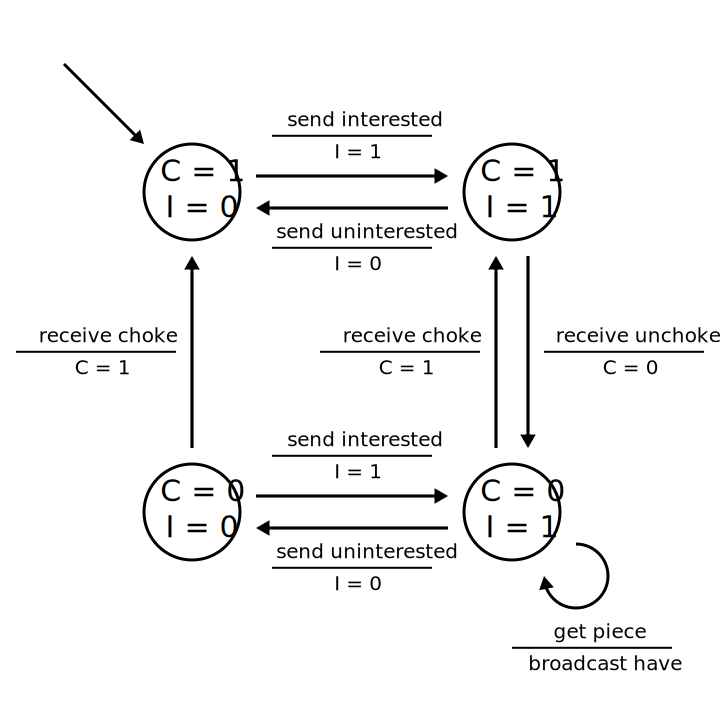
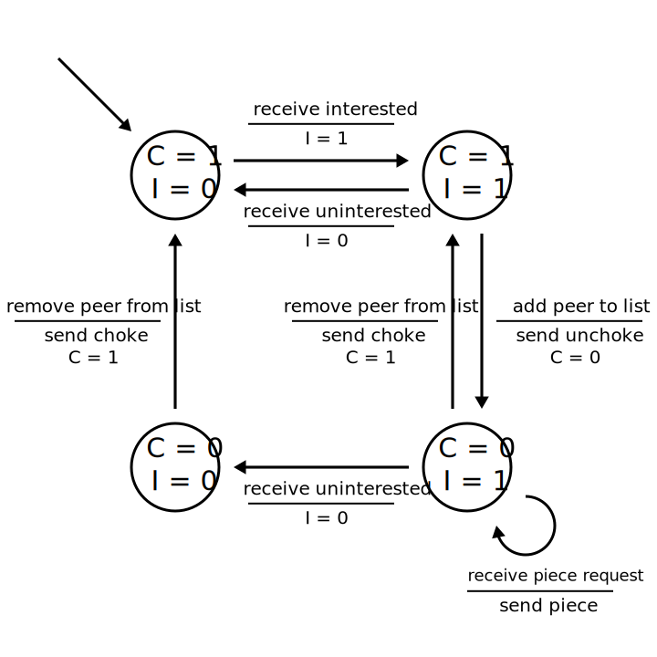

# Bittorrent

Charles Jin, Jason Kim, Marvin Qian, Harvey Xia

## Summary

This project is an implementation of the Bittorrent protocol. This includes a peer application that contacts a tracker server and exchanges data with other peers.

## Design Goals

In this implementation, we sought to implement the peer-to-tracker and peer-to-peer Bittorrent protocols. Interestingly, the official Bittorrent specification offers only a high-level description of these protocols, so we've designed and implemented protocols that meet the specification's requirements. We describe these protocols in more detail in further sections.

## How To Use

To make: `make`

To test: `./runtests.sh`

## Project Structure

The project is implemented in two primary packages: core and tracker. The core package contains code for the client application and peer-to-peer communication. The tracker package contains code for the tracker and peer-to-tracker communication.

TorrentParser.java - parses a file and returns a Torrent object

Torrent.java - object containing .torrent file fields

Tracker.java - the server that responds to requests from peers

Client.java - the bittorrent peer

MessageUtils - creates and parses bittorrent messages

## Sources

This implementation follows the protocol as described [here](https://wiki.theory.org/BitTorrentSpecification).

## Run

In order to run a basic tracker + seeder + leecher setup, run each of the following commands in a new terminal and in the order shown below:

#### Tracker

`java tracker.Tracker 6789`

#### Seeder

`java -classpath .:lib/json-20160212.jar:lib/junit-4.12.jar core.Client Client1 6000 tests/test.torrent tests/dataFolder1 registerFile`

#### Leecher

`java -classpath .:lib/json-20160212.jar:lib/junit-4.12.jar core.Client Client2 7000 tests/test.torrent tests/dataFolder2`

## Design

### Client

The client is composed of two main parts. One part handles outgoing connections to peers. The other presents a welcome socket that handles incoming connections from other peers.

These two parts of the client share a mapping from peers (IP-port pairs) to connection information. We identify a peer instance by its IP address and welcome socket port number.

We implemented the peer-to-peer protocol (i.e., the "peer wire protocol") using two finite state machines, one for the download actions of a client and one for the upload actions of a client, as shown below. For each file, the client maintains a list of four peers. If the client hasn't completed downloading the file, then this list contains the four peers that have provided the fastest *download* rates. If the client has completed downloading the file, then this list contains the four peers that have provided the fastest *upload* rates.

#### Downloader FSM

Note: C = peerChoking and I = amInterested.

#### Uploader FSM

Note: C = amChoking and I = peerInterested.

### Tracker

## Future Directions

Our implementation simplifies the protocol in a few ways:

- Instead of downloading a piece from a peer one block at a time, we download a piece all at once.
- We request pieces in simple sequential order instead of seeking the rarest piece first.
- We do not implement optimistic unchoking. This does not affect files with at most 4 peers, which suffices for the tests that we've written.

Implementing any of these features would improve the performance of the application.